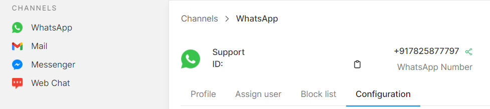

# 🔄 Channel Configuration

### How to Configure WhatsApp Messages and Replies on Gallabox?

* Go to the WhatsApp tab on your Gallabox account.&#x20;
* Select the phone number you wish to configure.
* Click on '**configuration**' and proceed with your required configurations.

### Configurations Available


[working-times.md](working-times.md)



[welcome-message.md](welcome-message.md)



[auto-reassign.md](auto-reassign.md)



[auto-reply.md](auto-reply.md)



[re-engagement-message.md](re-engagement-message.md)



[email.md](email.md)



[auto-resolve-chat.md](auto-resolve-chat.md)



[auto-update-resolve-message-opt-in.md](auto-update-resolve-message-opt-in.md)

