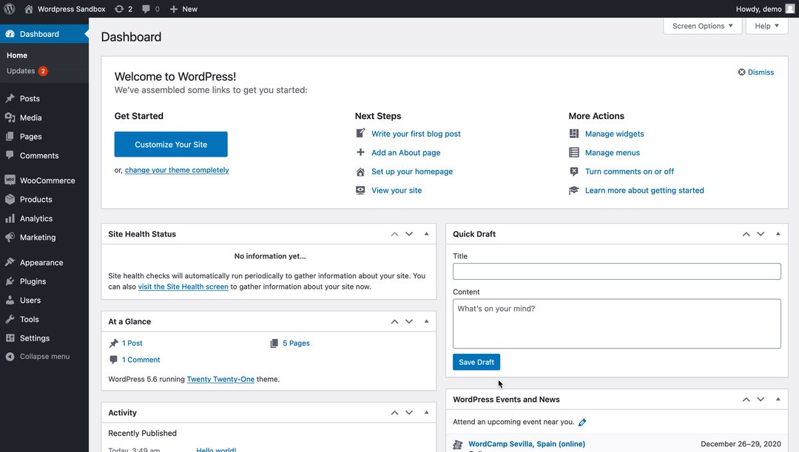

# WooCommerce Integration

### Generate Access Keys and Secret



1. Access your WordPress dashboard.
2. Select '**Settings**' in your _**WooCommerce**_ dropdown list.
3. Click on the _**Advanced**_ tab.
4. Click on _**REST API**_.
5. Click on the _**Create an API Key**_ button.
6. Enter the necessary details.
7. Select '**Read/Write**' from the _**Permissions**_ dropdown list.
8. Click on the _**Generate API Key**_ button.
9. Update your WooCommerce website URL, Consumer key & Consumer secret to access WooCommerce resources through APIs

You have now successfully generated your WooCommerce API Key, mail the details to developers@gallabox.com to get your integration started.


### Sample Message Templates

**Order Confirmation**

```markdown
Hey {{name}}!

Greetings from {{brandName}}.

We thank you for liking our product and placing an order for it.

✅🛒➖⚪✈➖⚪🚚

Your order, with #{{orderId}} for a value {{price}} has been placed successfully.
Now all you need to do is sit back & relax. You will receive an update once the order is shipped.

Cheers, 
Team {{brandName}}
```

****

**Order Shipped**

```markdown
Hi {{name}},

Your order with #{{orderId}} is now shipped and will be delivered soon.
You can track your shipment via tracking link {{trackingLink}}

✅🛒➖✅✈➖⚪🚚

Regards
Team {{brandName}}
```


**Order Pending**

```markdown
Hey {{name}}!

Greetings from {{brandName}}

This is a reminder message. Your order for {{productName}} from {{brandName}} 
with order id: {{orderId}} for a value {{price}} is pending payment. 
Kindly make the payment using the below link.

{{paymentLink}}

Cheers,
Team {{brandName}}
```


**Order Failed**

```markdown
Hey {{name}}!

Greetings from {{brandName}}

Your order for {{productName}} from {{brandName}} with order id: {{orderId}} for a value {{price}} is *Failed*. 
If you think this is a mistake kindly reach out to us.

Cheers,
Team {{brandName}}

```


**Order Cancelled**

```markdown
Hey {{name}}!

Greetings from {{brandName}}.

Your order for {{productName}} from {{brandName}} with order id: {{orderId}} for a value {{price}} is *Cancelled*. 
If you think this is a mistake kindly reach out to us.

Cheers,
Team {{brandName}}
```
