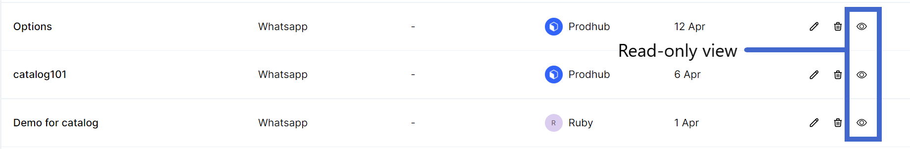

# Bot Full View

**No more compact views of your bot flow, with this new update users, can view their flow on their full screen as a ‘Read only’ view.**

### **How can I view the entire Bot with multiple Flows?**

Click on the read-only button on the right-hand side corner of your Bot. ****&#x20;

You will be directed to a full-screen view of your Bot with all the flows created within the Bot.&#x20;

.png>)
