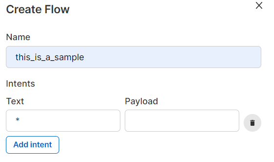
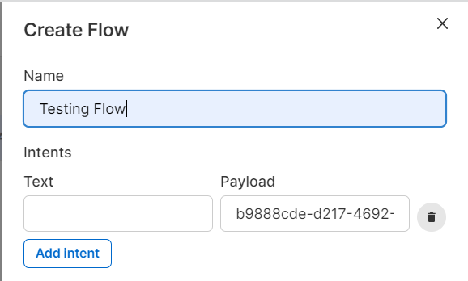
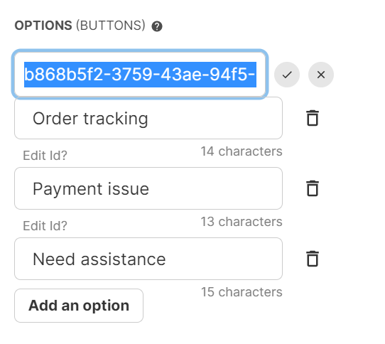
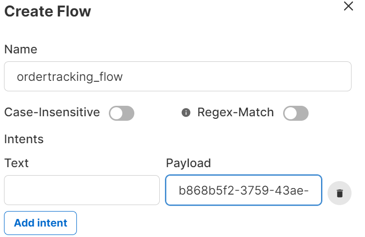
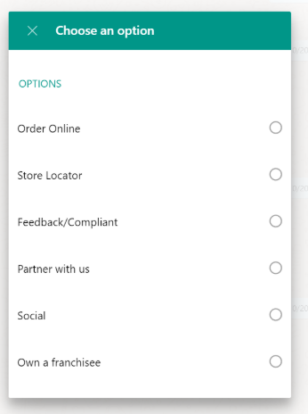
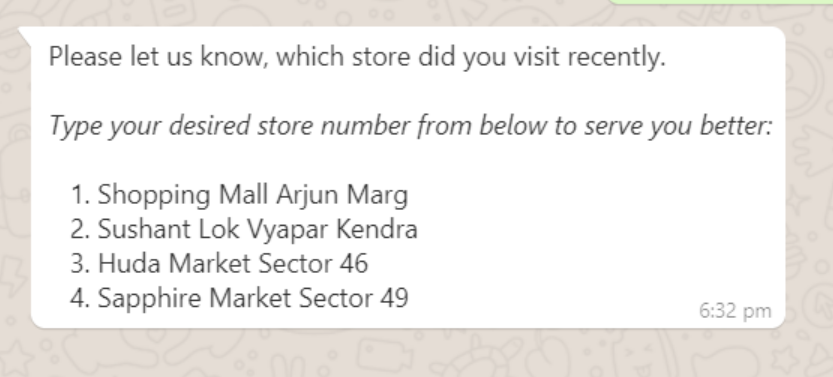

# FAQs

### 1. What is session TTL?

**Session TTL** - Threshold Time Limit, is the threshold time your bot will wait before closing the session with a user.&#x20;


Session TTL should only be inputted in minutes&#x20;


You can set timeout message and actions when the session is dropped without user's input.

### 2. How to Create a Bot?

Step a: Go to **Bots** in your Gallabox account and click on "**Add Bot**".

Step b: Name your bot and add the necessary session TTL, timeout message and click "**Create**".

You have successfully created a Bot, all you need to now is to create your bot flows with intents and publish your bot.

### 3. Can I customise the session timeout message?

Yes, the session timeout message can be customised according to your business requirements.

### 4. Can I create multiple flows within a Bot?

Yes, any number of flows with the correct intent/ payload can be created within a Bot.

### 5. What is 'Intent' ?

Within a chatbot, intent refers to **the keyword** the customer has in mind when initiating a conversation. Without an intent, the chatbot cannot function. If you'd like your chatbot to start for any and every work use " **\*** " as the intent.

### 6. What is Button 'Payload' ? How to use button payload?&#x20;

Payload is the unique ID given to each intent/option button created for the Bot flow. Button payloads are used in scenarios when the option keyword may be repetitive or similar in nature. Types of Payload:

* Intent Payload to link bot flows.
* Button Payload to link cards within a flow.

**How to use button payload:**&#x20;

Button payload can be used to trigger seperate bot flows. If for example:&#x20;

Flow 1: has three options - _**Order tracking, Payment issue, Need assistance**_. Each of these buttons has a payload, and the same keyword has been used in different flows.&#x20;

You can **copy the button ID - payload** and **paste it to the intent** **while creating the bot flow** for the specific button option.&#x20;

### 7. Can I use two different unique bots at the same time?

No, it is not possible to employ two unique bots at the same time in your channel.

### &#x20;8. Can I duplicate a pre-existing flow to create a new flow?

Yes, you can duplicate a flow and customise the pre-filled cards to create a new flow. This action promotes a faster method of creating a bot with the same conversational flow.

### 9. What is the difference between 'ask a question' and 'send a messsage' cards?

|                               Ask a Question Card                               | Send a Message Card                                        |
| :-----------------------------------------------------------------------------: | ---------------------------------------------------------- |
|           It can be linked to multiple cards depending on the options           | It can only be linked to one card                          |
| You cannot have an attachment but can have options like buttons, number, lists. | You can attach media files but cannot have options as well |
|                  You cannot make a circular flow with this card                 | You can make a circular flow with this card                |


A circular Bot can be created by ending your bot flow with a 'Send Message' card having a button option. The payload of the required button should be the intent of your next flow.&#x20;


### 10. Can I customise the error message in the ask a question card?

Yes, you can customise the error message according to your brand voice.

### 11. How to add a card in a flow?

Simply drag and drop your required card from the right-hand panel on your screen.&#x20;

### 12. Can I duplicate a card in a flow?

Yes, you can duplicate a card in the flow by clicking on the duplicate icon on the right-hand corner of your card.

### 13. Can I add variables to a card?

Yes, you can add variables to a card. Variables can be of two types:

* **Pre-existing data variables** - these variables are available for the bot to use through customer contact information or field collection metrics. Eg: \{{contact.name\}}
* **Acquired data variables** - these variables can be a response generated by the customer within the bot flow. Please note that these variables can only be used while collecting customer data in a conversational bot flow. Eg: \{{response.email\}}&#x20;

### 14. Can I add emojis to a card?

Yes, to add an emoji is your card click on the emoji or press ⊞ Win + ' **.** ' **** .

### 15. Can I format text in a card?

Yes, you can format text to **bold** , _italic,_ and ~~strikethrough~~ .

### 16. Is it mandatory to name a card?

Yes, it is mandatory to name a card. This is for a better understanding of your conversational flow when creating complex bot flows.

### 17. What is the maximum character length in a card?

The maximum character length within a card is 4096 characters.

### 18. What is add an option? What are the different types of options? buttons, number, list

Add an option is an interactive element within a bot flow. The different types of options are:&#x20;

* Button - 1-3 options with a character limit under 21

.PNG>)

* List - 3-10 options with a character limit under 21

* Number -  1-10+ options with a character limit over 21

### 19. How to avoid drop-offs in a bot flow?

The main reason for drop-offs in a bot flow is by trying to create a 'main menu' option in the middle of the flow. This should ideally be done at the end of your flow.

### 20. Can I attach media files to a card?

Yes, you can attach only one media file to a particular card. Media files can be of audio, video or image.

### 21. What is the action type? When can it be used in a flow?

Action type in a card is how you would like your bot to send the customer conversation to a particular agent or to your unassigned tab for any agent to take over. This type is usually used towards the end of a bot flow.

### 22. Can I integrate my Bot with my existing CRM?

Yes, you can integrate your bot flow with your CRM using the '**ASYNC Data**' option while creating a card.

### 23. How do I link cards?

To link two cards click on the right-hand circular button of card A and drag your cursor to card B.&#x20;

### 24. How do I create a circular Bot?

A circular Bot can be created by ending your bot flow with a 'Send Message' card having a button option. The payload of the required button should be the intent of your next flow. This is how you create a circular bot.

### 25. Can the bot take over from a template message?

Yes, your Bot can take over from a template message given that the intent payload matches the option(button) payload on the template message.

