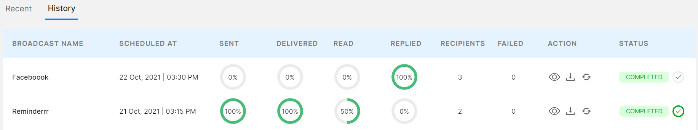
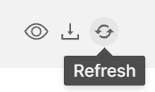
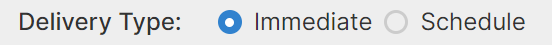

# Broadcast Analytics

### Broadcast Analytics Features

* Sent, Delivered, Read, and Replied rate. You can view this in real-time by refreshing the broadcast.

&#x20;

* Status of the broadcast: <mark style="color:orange;">Pending</mark>, <mark style="color:green;">Completed</mark>, Cancelled.
* Download analytics report to understand failed customer contacts.
* Viewing the broadcasted message.
* Canceling a broadcast created.&#x20;


A broadcast can only be canceled if it is scheduled to a time or date in the future. If the delivery type is "**Immediate**" it cannot be canceled. 


