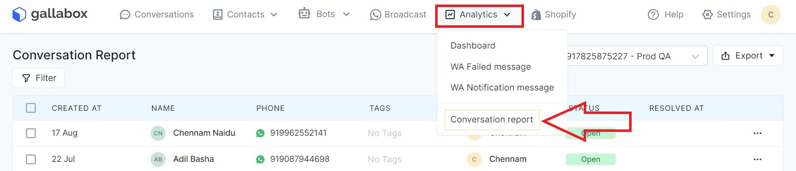
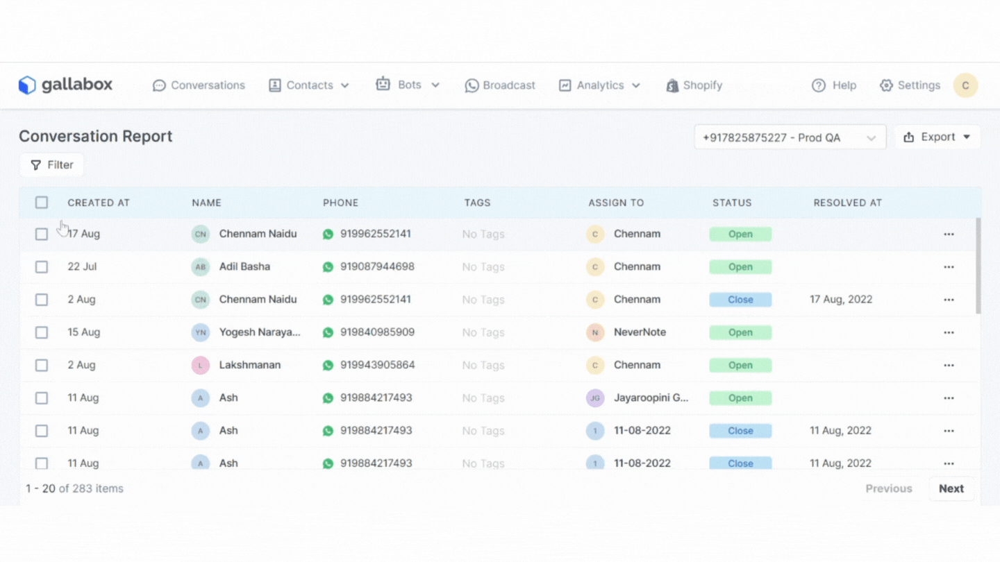

# 🗃 Conversation Report

## How to View Conversation Reports

Go to '**Analytics**' in the navigation menu> Click on '**Conversation Reports**' to view.&#x20;

### Conversation Status

&#x20; <mark style="background-color:green;">Open</mark> - The conversation has not been resolved by the agent and is still in the open status.

&#x20; <mark style="background-color:blue;">Close</mark> - The conversation has been resolved by the agent and is closed.

## Bulk Assign Conversations

Conversations can be individually assigned through the filter method or in bulk.&#x20;

**Step 1:** Go to the '**Conversation Reports**' tab and select the conversations to be assigned either individually by employing the filter or by selecting the '✅' check box at the top besides '**Created At**'.&#x20;

**Step 2:** Click on the agent you would like to assign the conversation to or type in their name in the top-right search bar. Confirm the reassignment by clicking on '**Confirm**'. <mark style="background-color:yellow;">Please note this rule will work on</mark> <mark style="background-color:yellow;"></mark><mark style="background-color:yellow;">**open conversations**</mark> <mark style="background-color:yellow;"></mark><mark style="background-color:yellow;">ONLY</mark>

.gif>)

## Bulk Resolve Conversations

Conversations can be individually resolved through the filter method or in bulk.&#x20;

**Step 1:** Go to the '**Conversation Reports**' tab and select the conversations to be resolved either individually by employing the filter or by selecting the '✅' check box at the top besides '**Created At**'.

.gif>)

**Step 2:** Click on '**Resolve**' at the top-right corner and confirm by clicking '**Confirm**'. You will see the change in status from <mark style="background-color:green;">open</mark> -> to <mark style="background-color:blue;">close</mark> . &#x20;

 (2).gif>)
