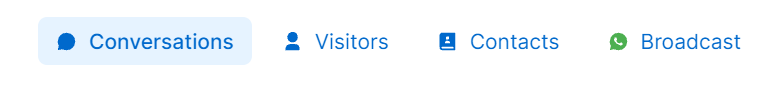
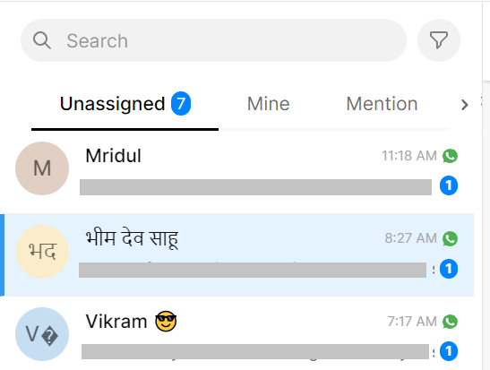
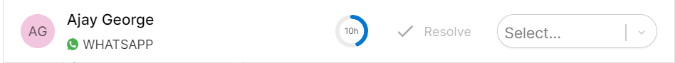

# 🈁 Conversations

### Sections of the Conversations Tab

1. Navigation Menu
2. Conversation List
3. Hero Conversation Section
4. Assignment and Session Window
5. Contact Information
6. Staff Information

### Navigation Menu&#x20;

The navigation menu on your dashboard allows you to toggle between your Conversations, Visitors, Contacts, and WhatsApp Broadcast.

### Conversation List

The conversation list comprises of all customer conversations in your team inbox. They are further segregated into : Unassigned, Mine, Mentions, Pinned, Open, and Resolved.&#x20;


[team-inbox.md](team-inbox.md)


### Hero Conversation Section

The hero conversation section on the dashboard is your main chat section. Agents and managers can chat with customers, add private notes, and @mention team members.&#x20;


[private-notes.md](private-notes.md)



[mentions.md](mentions.md)


### Assignment and Session Window

Conversations can be assigned to agents/managers using the drop-down button. This section also shows the 24hr session window with customer conversations.


[assignee.md](assignee.md)



What is a 24hr session window?

When a conversation is initiated by the user or a user responds to a template message, the WhatsApp policy allows for a business account to reply within the period of 24hrs. A session lasts for 24hrs after the last inbound message is sent from the user.&#x20;


### Contact Information

The contact information section allows you to input customer data or view pre-existing data. Tagging is a feature within the conversation list that can help agents/managers filter leads.


[tagging.md](tagging.md)


To know more about adding and importing contacts:


[add-contact.md](../contacts/add-contact.md)



[import-contact.md](../contacts/import-contact.md)


### Staff Information&#x20;

The staff information section allows for agents and managers to view their profiles and access settings.


[Broken link](broken-reference)


