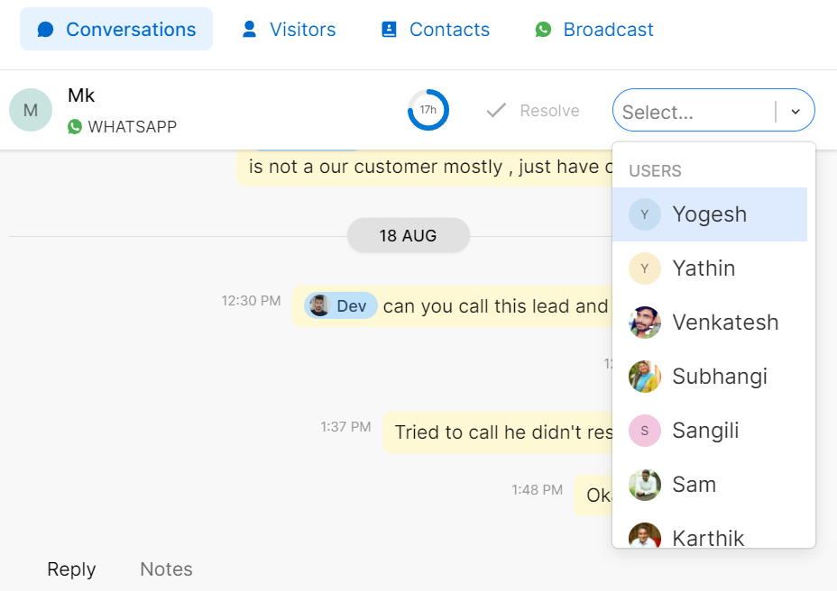

# 👨💼 Assignee



### How to Assign a conversation?

There are two methods to assign a conversation to a team member:

#### **1. Dropdown Assignment**

Click the dropdown button on the right-hand corner of your chat and easily assign conversations to teammates.

#### **2. Reply Assignment**

When you reply to an unassigned customer conversation you are by default assigned to the conversation. If you wish to change the assignment follow the dropdown menu at the right-hand corner of your chat.
