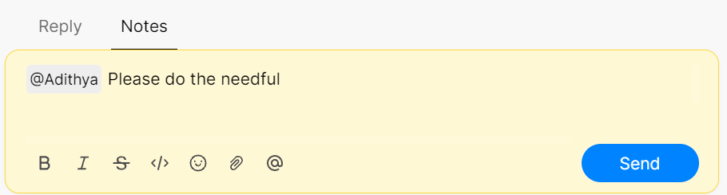

# 📥 @Mentions



### What are mentions?&#x20;

Apart from listing down your private notes, you can use mentions by typing **@** to tag team members in conversations. This allows for a quicker response time from team members rather than switching from different channels to communicate.&#x20;

### How to @mention team members?

Type '**@**' followed by the team member's name to mention them in conversations.

