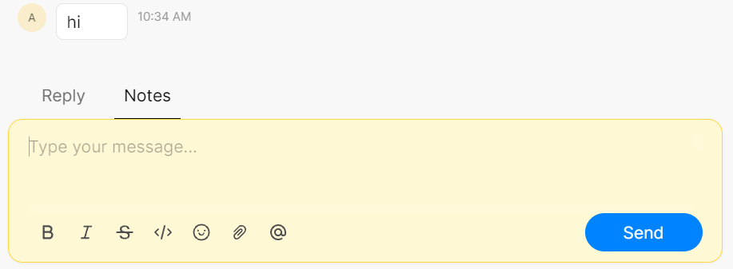

# 🗒 Private Notes



### What are private notes?

Gallabox's tool features private notes which are similar to your modern-day sticky notes. This feature helps your agents and managers to leave notes on customer conversations for a better understanding of your client, ensuring a smoother handover process between agents, and listing down requirements on the go during a call.&#x20;


Private notes are internal and cannot be viewed by your customer. They are shown in a yellow text bubble to differentiate between messages.&#x20;


### How to Add a Private Note?

When conversing with a customer you can toggle between "**Reply**" and "**Notes**". To add a private note click on "**Notes**", type in your comments, and hit "**Send**".&#x20;


Note: you can @Mention any member on your notes.



[mentions.md](mentions.md)

