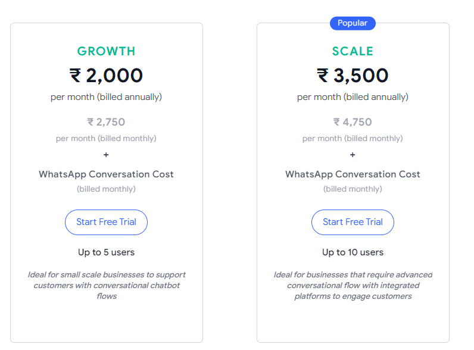
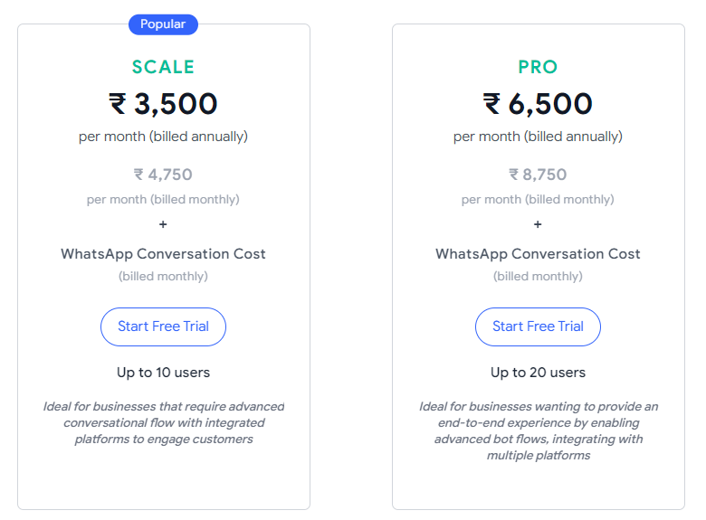

# 📈 Growth, Scale & Pro Plan Pricing

### 1. What is the difference between the Growth plan and the Scale plan?&#x20;

Our Growth plan is a basic subscription plan with minimal feature requirements which will allow your WhatsApp business account to use the Gallabox tool at Rs 2000/ month plus tax, billed annually.&#x20;

If you were to choose our Scale plan for Rs. 3500/month plus tax billed annually, the added benefits of advanced Bot actions with 100 Bot blocks,  analytics metrics, and advanced assignment rules will be provided. Up to 10 Agent logins, 20 Canned responses, and WhatsApp/Email support with an SLA of 24 hours will be the benefits of the Scale plan.

To switch to the Scale plan or know more about our features contact: <mark style="color:blue;">support@gallabox.com</mark>.&#x20;

### 2. What is the fee to switch from the Growth plan to the Pro plan?&#x20;

Switching from the Growth plan to the pro plan will increase your annual prepaid subscription by Rs. 4500/ month plus tax. With this increment in cost, your account acquires added benefits of a customised advanced Chatbot builder, integrations with multiple systems, advanced analytics dashboard, agent logins of 20 users, unlimited additional fields and much more.

If you wish to switch to the Pro plan now contact: <mark style="color:blue;">support@gallabox.com</mark>.

### 3. Can I switch from the Growth plan to the Scale plan?&#x20;

Yes, you can contact our support team at <mark style="color:blue;">support@gallabox.com</mark> who will assist you with the change in the subscription plan process.&#x20;

### 4. What is the difference between the Scale plan and the Pro plan?&#x20;

The Pro plan for Rs.6500/ month, billed annually has the added benefits of advanced Bot actions with unlimited Bot blocks, advanced assignment and rule system, system integrations apart from those offered in the scale plan like Monday.com, Hubspot, unlimited additional fields, unlimited canned responses, 20 agent logins, and a quicker support response time under 12hrs as a priority customer at Gallabox.&#x20;

To switch to the Pro plan now contact <mark style="color:blue;">support@gallabox.com</mark>&#x20;

### 5. I have opted for the Growth plan. I want to increase my integrations, what are the charges?&#x20;

Gallabox can increase the integrations for your WhatsApp business account at Rs. 500/ month plus tax.&#x20;

### 6. I want to downgrade from the Scale plan to the Growth plan, I have opted for the annual subscription. Will I get a refund?&#x20;

Yes, you will receive a refund according to the usage months under the Scale plan and the cost incurred for the initial setup. Your invoice amount for the change in plan will be a separate charge should you wish to pay monthly/ annually.
