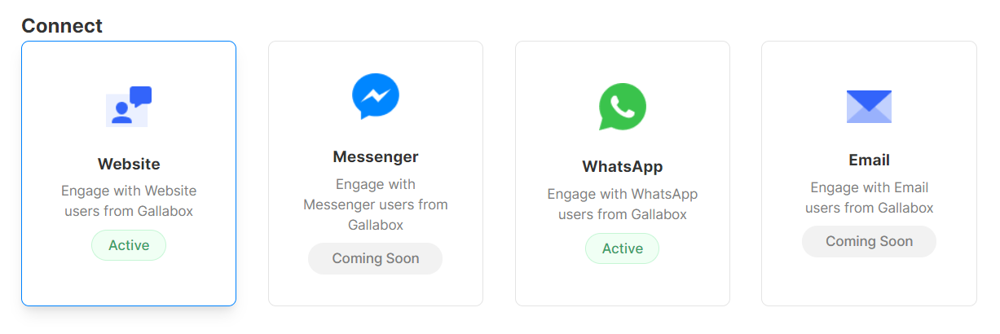

# 👤 Connect

### Connect

This menu option under setting will show your activated channels under Gallabox. Activation will be done by Gallabox for you to ensure a smooth onboarding process. Required information will be collected from businesses.&#x20;

#### Add a New Website and Live Chat Widget

* Click on "**+Add New**" under the website menu. &#x20;

* Input your website URL, name, widget headline, status tagline, theme colour, button colour, logo, and so on. You can customise your live chat widget as required to show on your website.

* Click on "**Apply**" to add your new website channel and live chat widget.
