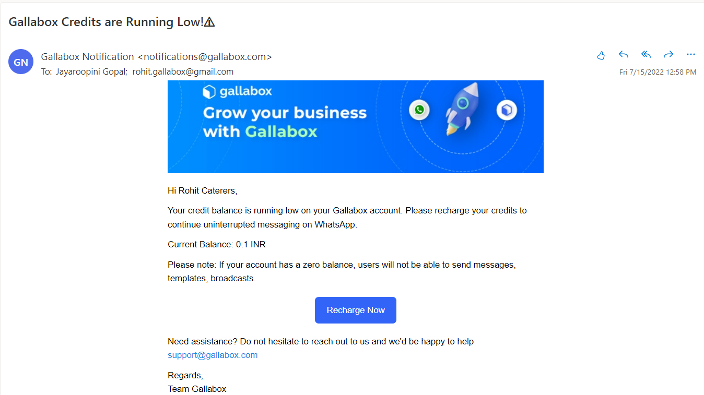

# 💸 Message Credits

## How to Manage/Add Credits to My Gallabox Account?&#x20;

With the launch of the new pre-paid model adding credits to your account can be done in a few clicks.&#x20;

All you have to do is: Go to **Settings**> under Account go to '**Message Credits**' > **Enter the amount** you would like to add to your account> click on '**Add Credits**' > **make the payment** and that it, it's as simple as recharging your phone.&#x20;

<figure><figcaption></figcaption></figure>

You will be notified once the transaction has been completed like so and you will receive a payment confirmation via mail.&#x20;

<figure><figcaption></figcaption></figure>

<figure><figcaption></figcaption></figure>

## Message Credits Features&#x20;

1. **Get notified** in your Gallabox account and by mail when your account balance is running low INR - Rs 100 and USD - $5 respectively.
2. **Recharge** for a minimum of Rs. 100/$5 to a maximum of Rs.1,00,000/$2000 at once. _Please note that a 18% GST will be levied on INR transactions._&#x20;
3. If you have a **pending payment** to be made, pop-ups will arise in your account to complete the payment. You can also cancel pending payments and recharge with new amounts.&#x20;
4. **View conversation reports** of Free conversations, Business-initiated conversations, User-initiated conversations, and export up to the last 6 months of usage at any point in time.&#x20;
5. **Estimated amount to be spent for campaigns** and broadcasts will be displayed while creating a new broadcast, if the balance is insufficient the account will be notified.&#x20;

## ⚠️ <mark style="background-color:yellow;">Important Terms to Note</mark>

* If your **account balance is low or in negative** you will not have access to use any features in your account like that of replying to conversations, broadcast, etc. until you have recharged your account. Eg:

<figure><figcaption></figcaption></figure>

<figure><figcaption></figcaption></figure>

<figure><figcaption></figcaption></figure>

* **You will be notified** via your account and email when your balance is running low. Eg:

<figure><figcaption></figcaption></figure>

<figure><figcaption></figcaption></figure>

* If you have **scheduled a broadcast** and your credits are insufficient or lower than required to carry out the broadcast **it will not be sent and in a failed status**. Eg:&#x20;

<figure><figcaption></figcaption></figure>

If you require more assistance on message credits and it's usage, feel free to reach out to our support team on our dedicated support number or by raising a ticket in your Gallabox account.&#x20;
